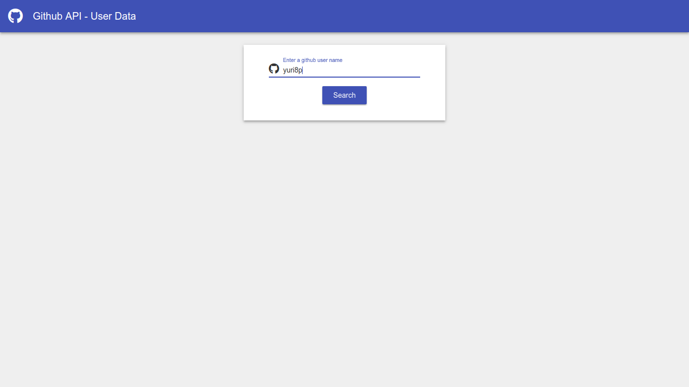
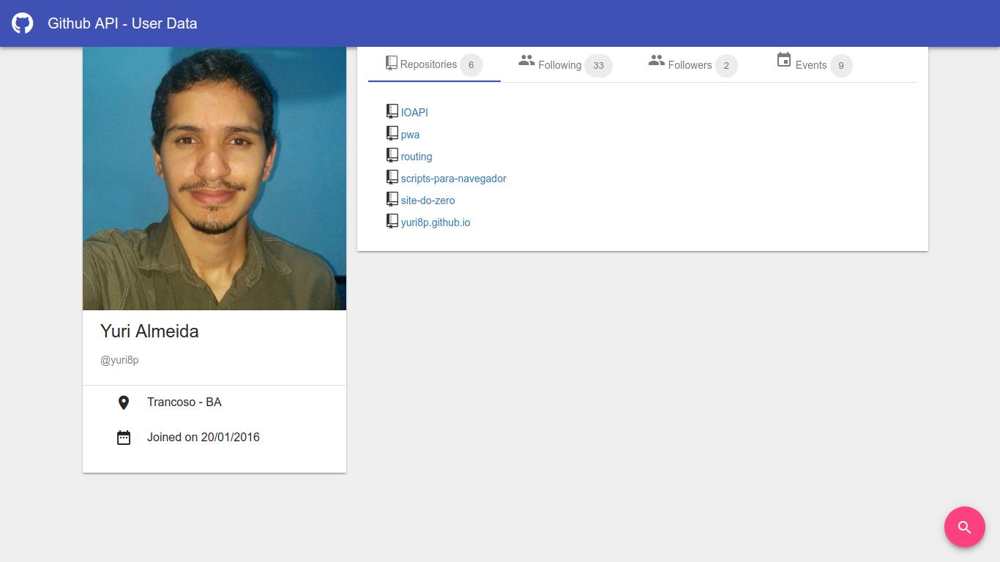
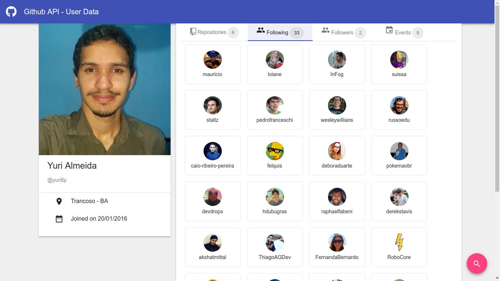

# Creditoo hiring-front-end test - github-userdata

You can see the app running at the following address: [https://yuri8p.github.io/github-userdata/dist](https://yuri8p.github.io/github-userdata/dist).

## Installation guide

- Make sure you have node and npm installed in you computer.
- Open the terminal and type `node -v` or `npm -v` to check the version of theses applications or if they are installed.
- If you uses Windows, download and install the node installer from `https://nodejs.org/download/`.
- Otherwise, if you uses linux, install the last npm and nodejs LTS version with nvm (node version manager). Here we are using the version 9.
	- `curl https://raw.githubusercontent.com/creationix/nvm/v0.31.0/install.sh | bash; source ~/.bashrc; nvm install 9`
- Clone the repository to your computer.
	- `git clone https://github.com/yuri8p/github-userdata.git`
- Change the current working directory in the terminal.
	- `cd github-userdata`
- Install node packages from npm.
	- `npm install`
- Run the development server.
	- `npm start` or `ng serve` - if you have `@angular/cli` npm package installed -.
- Access the following address `http://localhost:4200` by the browser and use this Angular application.

## Preview images from the project:

## Development server

Run `ng serve` for a dev server. Navigate to `http://localhost:4200/`. The app will automatically reload if you change any of the source files.

## Build

Run `ng build` to build the project. The build artifacts will be stored in the `dist/` directory. Use the `-prod` flag for a production build.

